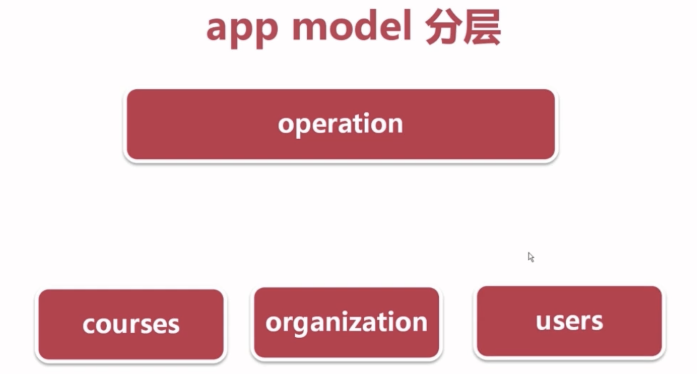
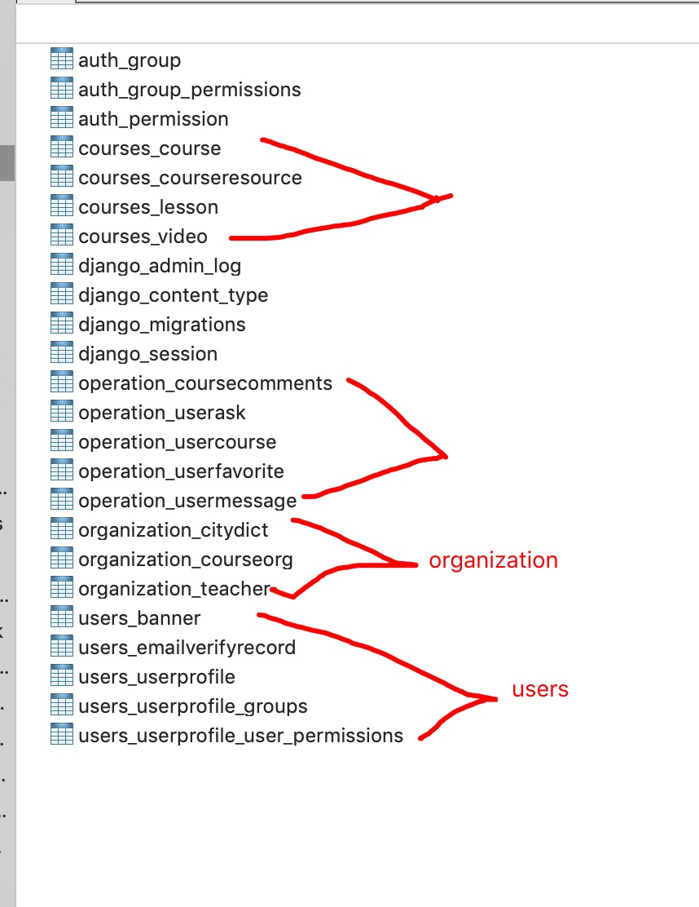
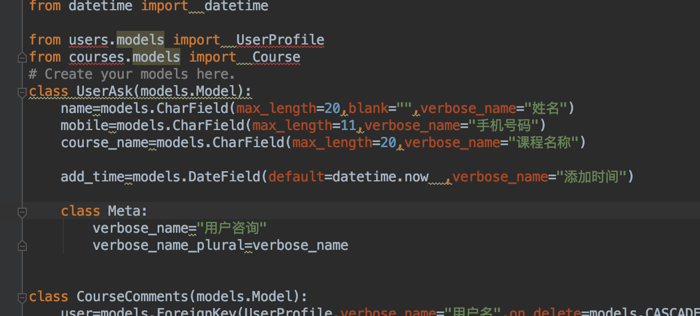
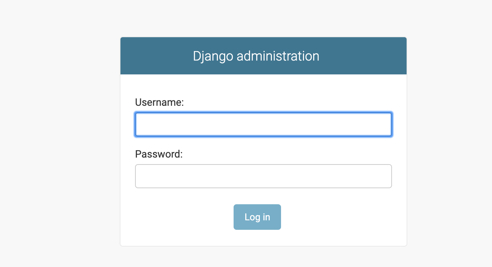
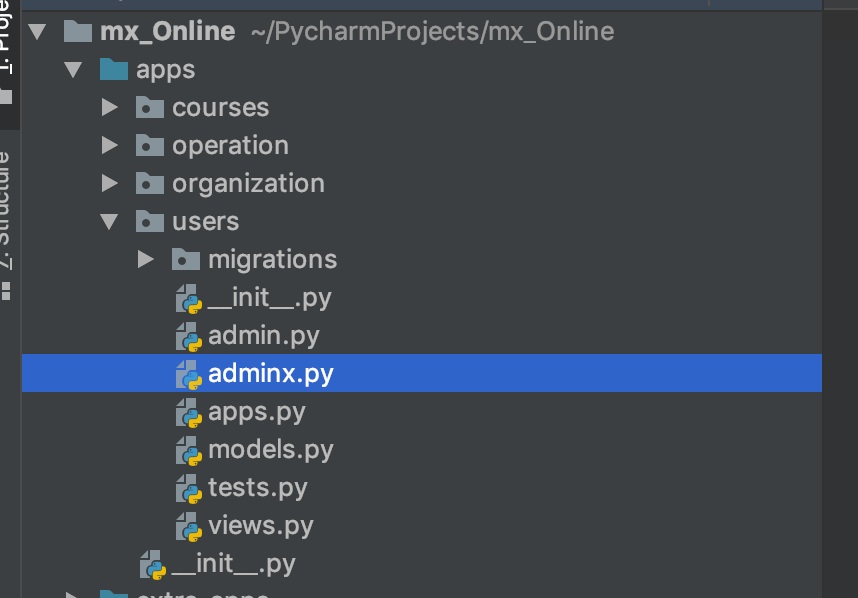
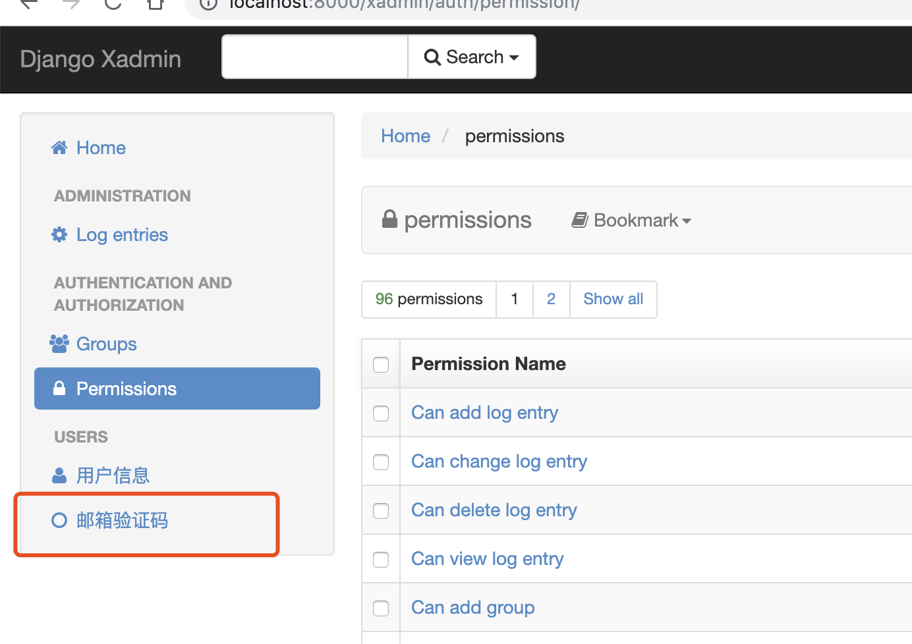

### app设计
user - 用户管理
course -课程管理
organizaton - 机构和教师管理
operation - 用户操作管理
### 搭建环境
>mkvirtualenv mxonline
>pip3 install django==2.2.0


### 配置mysql连接
```
DATABASES = {
    'default': {
        'ENGINE': 'django.db.backends.mysql',
        'NAME': "mxonline",
        'USER':"root",
        'PASSWORD':"86680334",
        'HOST':"47.98.63.111",
    }
}
```
生成数据库脚本文件
> makemigrations

>migrate


### 设计user-app 的model
首先新建app 
>startapp users
编写modle
自定义userprofile 覆盖默认的user表
需要继承自django的Users
```

##继承django的User表
from  django.contrib.auth.models import AbstractUser


class UserProfile(AbstractUser):
    #添加自己的字段
    nick_name=models.CharField(max_length=50,verbose_name="昵称",default="")
    birthday=models.DateField(verbose_name="生日",null=True,blank=True)
    SEX_CHOICES = (("male","男"),("female","女"))

    sex= models.CharField(
        max_length=2,
        choices=SEX_CHOICES,
        default="female"),
    address=models.CharField(max_length=100,default="",verbose_name="地址")
    mobile=models.CharField(max_length=11,null=True,blank=True)
    image=models.ImageField(upload_to="image/%Y/%m",default="image/default.png",max_length=100)
```
定义表的mate信息
   ```
  class Meta:
        verbose_name="用户信息"
        verbose_name_plural=verbose_name
   ```

### 注册APP
setting文件中配置
```
INSTALLED_APPS = [
    'django.contrib.admin',
    'django.contrib.auth',
    'django.contrib.contenttypes',
    'django.contrib.sessions',
    'django.contrib.messages',
    'django.contrib.staticfiles',
    'users',
]

AUTH_USER_MODEL="users.UserProfile"

```
重启项目
此时会遇到几个问题
>1. Cannot use ImageField because Pillow is not installed
>2. ValueError: Dependency on app with no migrations: users
解决办法
1. pip3 install Pillow 
2. 重新进行makemigrations users   

此时在报错
>django.db.migrations.exceptions.InconsistentMigrationHistory: Migration admin.0001_initial is applied before its dependency users.0001_initial on database 'default'.
删除之前数据库中的表 
重新执行 migrate
重合服务成功

### 对app进行分层
为什么需要分层---为了防止互相循环引用



### 继续构建model

>startapp courses
>一个课程对应多个章节 一对多
>一个章节下有多个视频  一对多
所以可以建立三张表 课程表 章节表   视频资源表
课程需要下课件--->所以课程对应多个课件  一对多
第四张 课程资源表   一对多

分别创建organization,operation


将所有apps放到apps下管理
此时会发生


此时需要将app作为项目的根路径


### 快速搭建后台管理系统
后台管理系统 
特点 权限管理、少前端样式、快速开发

django自身有一个app admin
  >  'django.contrib.admin',
其本身也配置了路径
>urlpatterns = [
    path('admin/', admin.site.urls),
]

访问localhost:8000/admin


如何创建用户
python3 manage.py createsuperuser


#### model注册到admin中
将modle注册到admin中去


### 安装x-admin
安装方式一： 通过pip安装  pip install  xadmin

安装完成后在setting中配置xadmin
INSTALLED_APPS  添加,'xadmin','crispy_forms'

此时重启项目会报错
>xadmin错误NameError:name 'reload' is not defined
imp.reload(sys)

再次重启
又报错
>AttributeError: module 'sys' has no attribute 'setdefaultencoding'
原因Python3字符串默认编码unicode, 所以sys.setdefaultencoding也不存在了
所以直接去掉sys.setdefaultencoding
再次重启又报错
>ImportError: cannot import name 'smart_unicode' from 'django.utils.encoding' 

此时此问题无法解决 因为Xadmin与python3兼容性做的太差
卸载xadmin  pip3 uninstall xadmin
下载新的版本
>https://github.com/sshwsfc/xadmin/tree/django2

在项目中，新建extra_apps文件夹，用来存放第三方库，并将xadmin拷贝进去，如下： 
注册extra_apps文件夹到source
使用pycharm的话，在文件夹右键，make sources root
在项目settings.py文件夹中，通过代码形式进行注册，如下 
 
将xadmin添加到settings.py应用列表
INSTALLED_APPS = [ 'django.contrib.admin', 'django.contrib.auth', 'django.contrib.contenttypes', 'django.contrib.sessions', 'django.contrib.messages', 'django.contrib.staticfiles', # 需要添加的两个app 'xadmin', 'crispy_forms', ]
 
sys.path.insert(0,os.path.join(BASE_DIR,"apps"))
sys.path.insert(0, os.path.join(BASE_DIR, 'extra_apps'))
>另外将makemigrations中生成的下外键指向的app.coures.xxx 中的apps删除掉
>modles中导入from apps.course等类似的  apps也要删除
使用migrate同步数据表
python manager.py makemigrations 
python manager.py migrate
 
运行xadmin
在urls.py中进行xadmin的配置：
import xadmin
urlpatterns = [
path(r'xadmin/', xadmin.site.urls),
]
#### 将modle注册到xadmin
xadmin和admin用法相似
这里需要在app下新建一个文件 adminx.py



ps这里要改为site
注册后


####  增加列名和查询条件


